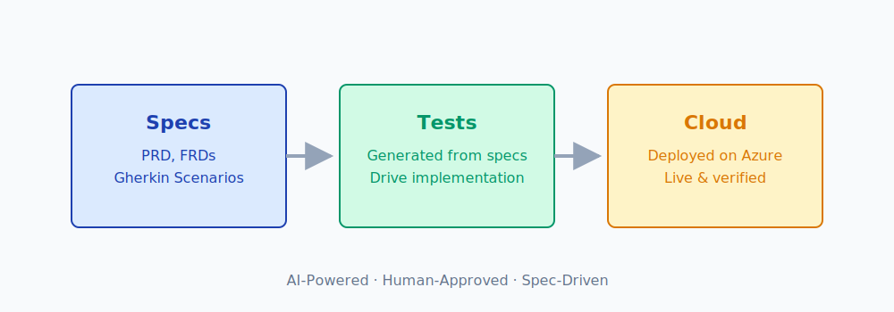

# spec2cloud MicroHack

## MicroHack Introduction

This MicroHack walks you through **spec-driven development with AI** — you write a product spec in plain language, AI agents implement it, and you verify at every step that what was built matches what you asked for.



You'll build a **Task Board** app — a minimal kanban board where users can capture tasks, move them through *To Do → In Progress → Done*, and delete them when they're finished. No login required. No database — just an in-memory store to keep scope tight.

The entire pipeline — spec refinement, wireframes, test generation, implementation, and Azure deployment — is driven by AI agents. **You approve, not type.**

## MicroHack Context

**spec2cloud** is built around the idea that the most valuable asset in a codebase is not the code — it's the specification. Given a good enough spec, you can regenerate the implementation at any time. What you can't regenerate is a precise, verified description of **what the software is supposed to do**.

The pipeline uses the **Ralph Loop**: a single AI orchestrator that reads state, determines the next task, picks the right skill, executes, verifies, and repeats — pausing at human gates for your approval.

```
PRD → Spec Refinement → UI Prototypes → Increment Plan → Tech Stack
     → [per increment] Tests (from spec) → Contracts → Implementation → Verify → Deploy → ✅
```

## Objectives

After completing this MicroHack you will:

- Understand how **specifications drive development** — PRD → FRD → Gherkin → Tests → Code
- Know how to use **AI agents** to implement a full-stack application from a plain-language spec
- Understand the role of **human gates** as verification checkpoints throughout the pipeline
- Be able to deploy to **Azure Container Apps** using the Azure Developer CLI (`azd`)
- Appreciate that **tests derived from specs** are the proof that requirements are met

## MicroHack Challenges

### General Prerequisites

This MicroHack has a few but important prerequisites. Complete these before starting the session to use hack time most effectively:

- **Azure subscription** with Contributor access ([create a free account](https://azure.microsoft.com/free/) if needed)
- **GitHub account** with an active **GitHub Copilot** license
- **VS Code** with GitHub Copilot and Copilot Chat extensions
- One of:
    - **Local dev tools:** Node.js 20+, .NET SDK 9+, Azure Developer CLI, GitHub CLI
    - **GitHub Codespaces** access (included with GitHub Free — 60 hours/month)

### Challenges

- [Challenge 1 — Prerequisites & Environment Setup](challenges/challenge-01.md) ← Start here
- [Challenge 2 — Write Your PRD](challenges/challenge-02.md)
- [Challenge 3 — Product Discovery (Phase 1)](challenges/challenge-03.md)
- [Challenge 4 — Increment Delivery (Phase 2)](challenges/challenge-04.md)
- [Challenge 5 — Verify, Celebrate & Tear Down](challenges/challenge-05.md)

## Solutions — Spoiler Warning

- [Solution 1 — Prerequisites & Environment Setup](solutions/solution-01.md)
- [Solution 2 — Write Your PRD](solutions/solution-02.md)
- [Solution 3 — Product Discovery (Phase 1)](solutions/solution-03.md)
- [Solution 4 — Increment Delivery (Phase 2)](solutions/solution-04.md)
- [Solution 5 — Verify, Celebrate & Tear Down](solutions/solution-05.md)

## Troubleshooting

| Symptom | Fix |
|---------|-----|
| `azd provision` fails with quota error | `azd env set AZURE_LOCATION westeurope` and retry |
| `azd auth login` token expired | Run `azd auth login` again |
| Agent seems stuck in a loop | Ask: *"Read the resume skill and continue from current state"* |
| Tests failing after implementation | Ask: *"Run the test runner skill and fix any failures"* |
| Smoke tests fail after deploy | Agent will auto-rollback — review and re-approve |
| `npm install` fails | Delete `node_modules` and `package-lock.json`, re-run |
| Playwright browser not found | Run `npx playwright install` |
| Copilot Chat not available | Ensure extensions are installed and you're signed in |

## Contributors

- [spec2cloud template](https://github.com/EmeaAppGbb/shell-typescript) by the EMEA App GBB team
