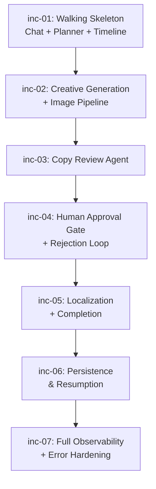

# Increment Plan: AI Marketing Campaign Assistant

## Overview

This plan delivers the AI Marketing Campaign Assistant in 7 increments, building the application progressively along its linear agent pipeline: **Planner → Creative Generator → Copy Reviewer → Human Approval → Localizer**. Each increment produces a deployable application with increasing capability.

**Strategy:**
- **Walking skeleton first** — Increment 1 wires chat input → one agent → streamed output to prove the architecture end-to-end.
- **Pipeline in order** — Agents are added in pipeline order (Planner, then Creative, then Reviewer, then Approval, then Localizer) since each depends on the previous.
- **Cross-cutting concerns woven in** — Persistence and observability are introduced incrementally alongside each agent, not bolted on at the end. Each increment persists its stage data and adds structured logging for the new agent.
- **Human-in-the-loop is a milestone** — The approval gate (Increment 4) introduces the interrupt pattern and rejection loop, which is the application's architectural centerpiece.

## Increment Summary

| # | ID | Name | FRDs | Complexity | Description |
|---|---|---|---|---|---|
| 1 | `inc-01` | Walking Skeleton — Chat + Planner | `chat-interface` (partial), `campaign-planning`, `campaign-timeline` (partial), `data-persistence` (partial), `observability` (partial) | M | Split-panel layout, basic chat, Campaign Planner agent with streaming, timeline shell, planning stage persistence, structured logging foundation |
| 2 | `inc-02` | Creative Generation + Image Pipeline | `creative-generation` (initial gen only), `chat-interface` (partial), `data-persistence` (partial), `campaign-timeline` (partial), `observability` (partial) | L | AI image generation, caption + hashtags, status messages during gen, image storage/serving, creative stage persistence, agent tracing |
| 3 | `inc-03` | Copy Review Agent | `copy-review`, `data-persistence` (partial), `campaign-timeline` (partial), `observability` (partial) | S | Brand alignment, legal, and tone checks; structured review report with verdict; review stage persistence |
| 4 | `inc-04` | Human Approval Gate + Rejection Loop | `human-approval`, `creative-generation` (rejection handling), `chat-interface` (partial), `campaign-timeline` (partial), `data-persistence` (partial), `observability` (partial) | L | Workflow pause, approve/reject UI, rejection with feedback + scope, Creative Generator re-invocation loop, iteration history, rejection metrics |
| 5 | `inc-05` | Localization + Completion | `localization`, `chat-interface` (partial), `campaign-timeline` (partial), `data-persistence` (partial), `observability` (partial) | M | Market selection UI, parallel translations, hashtag adaptation, original English preserved, completion summary card, New Campaign button |
| 6 | `inc-06` | Persistence & Resumption | `data-persistence` (remaining), `chat-interface` (partial) | M | Page refresh resumption from any stage, full chat history restoration, DB-unreachable error handling, New Campaign during active pipeline, campaign archival lifecycle |
| 7 | `inc-07` | Full Observability + Error Hardening | `observability` (remaining), `chat-interface` (partial) | S | Full distributed tracing with span hierarchy, trace context propagation, Prometheus /metrics endpoint, AI retry UX polish across all agents |

## Detailed Increments

---

### Increment 1: Walking Skeleton — Chat + Planner

- **ID**: `inc-01`
- **FRDs**: `chat-interface` (partial), `campaign-planning` (full), `campaign-timeline` (partial), `data-persistence` (partial), `observability` (partial)
- **Scope**:
  - **`chat-interface`**: FR-1 (split-panel layout), FR-2 (message input and submission), FR-3 (token-by-token streaming for text agents), FR-5 (structured data atomic delivery — plan block)
  - **`campaign-planning`**: FR-1 through FR-8 (all — brief validation, structured plan generation, smart defaults, markdown output, auto-handoff signal, LLM retries)
  - **`campaign-timeline`**: FR-1 (display six stages), FR-2 (active stage highlight), FR-3 (completed stage distinction), FR-4 (real-time updates — Planning stage only)
  - **`data-persistence`**: FR-1 (persist at planning stage transition only — brief + plan)
  - **`observability`**: FR-1 (structured logging for planner agent actions), FR-8 (log format: pino, JSON, stdout)
- **Screens/Flows**:
  1. User sees split-panel: chat on left, timeline on right (all 6 stages pending).
  2. User types a campaign brief and submits.
  3. Brief is validated (empty/short rejected, long truncated).
  4. Campaign Planner agent streams explanatory text token-by-token, then plan renders atomically.
  5. Timeline updates: "Planning" active → complete.
  6. Plan data persisted to database.
  7. After plan displays, system signals readiness for next agent (Creative Generator not yet implemented — shows "Coming soon" or similar placeholder message).
- **Dependencies**: None — this is the first increment.
- **Complexity**: M — Significant wiring: LangGraph agent graph, CopilotKit integration, SSE streaming, Express API, Next.js frontend, database setup, pino logging. However, only one agent with relatively simple LLM interaction.
- **Definition of Done**:
  - User can type and submit a brief in the chat.
  - Brief validation works: empty/short rejected, long truncated with notification.
  - Campaign Planner produces a structured plan with all 7 fields.
  - Smart defaults applied when brief is vague (Instagram, General audience, Professional).
  - Plan explanation streams token-by-token; structured plan block appears atomically.
  - Timeline shows "Planning" as active during generation, complete afterward.
  - Campaign brief + plan persisted to database after planning completes.
  - Structured JSON logs produced for planner start, complete, retries, errors.
  - LLM failures retried up to 3 times; error + retry button shown on exhaustion.
  - All unit tests, Cucumber BDD tests, and Playwright e2e tests for this increment pass.
  - Application deploys to Azure.

---

### Increment 2: Creative Generation + Image Pipeline

- **ID**: `inc-02`
- **FRDs**: `creative-generation` (partial), `chat-interface` (partial), `data-persistence` (partial), `campaign-timeline` (partial), `observability` (partial)
- **Scope**:
  - **`creative-generation`**: FR-1 (receive plan), FR-2 (AI image generation), FR-3 (caption generation 100–300 chars), FR-4 (hashtag generation 5–10), FR-5 (status messages during generation), FR-9 (error handling with retries), FR-10 (image storage and URL serving), FR-11 (auto-handoff to Copy Reviewer — signal only, review agent not yet implemented)
  - **`chat-interface`**: FR-4 (status messages during image generation — spinner, progress updates at 15s and 40s)
  - **`data-persistence`**: FR-1 (persist at creative stage — image URL, caption, hashtags, iteration number), FR-2 (image storage and URL serving)
  - **`campaign-timeline`**: FR-4 (real-time update — Generating stage active/complete)
  - **`observability`**: FR-1 (structured logging for creative generator), FR-2 (distributed tracing introduction — root campaign span + agent child spans for planner + creative), FR-4 (agent duration metric — histogram)
- **Screens/Flows**:
  1. After Planner completes (inc-01), Creative Generator auto-starts.
  2. Status messages appear: "🎨 Generating your campaign image…" → "⏳ Still working…" (15s) → "🔄 Almost there…" (40s).
  3. Image renders inline in chat at preview size.
  4. Caption and hashtags display below the image.
  5. Timeline updates: "Generating" active → complete.
  6. Image saved to storage, URL persisted. Creative data persisted.
  7. System signals readiness for next agent (Copy Reviewer placeholder).
- **Dependencies**: `inc-01` — requires chat interface, planner output, timeline, persistence foundation.
- **Complexity**: L — AI image generation API integration (gpt-image-1), image storage/serving pipeline, status message timing, caption/hashtag constraint enforcement, introduction of distributed tracing.
- **Definition of Done**:
  - Planner completion auto-triggers Creative Generator.
  - A real AI-generated image is produced (not placeholder).
  - Caption is between 100–300 characters; hashtags are 5–10 items.
  - Status messages appear at 0s, 15s, and 40s during image generation.
  - Image displayed inline in chat; caption + hashtags displayed below.
  - Image saved to storage and servable via `/api/campaign/{id}/image/{version}`.
  - Creative data persisted to database after generation.
  - Timeline shows "Generating" active during gen, complete afterward.
  - Structured logs for creative generator (start, complete, retry, error).
  - Distributed trace: root span + planner child + creative child + AI call child spans.
  - Agent duration histogram metric recorded.
  - LLM/image API failures retried up to 3 times; error + retry button on exhaustion.
  - All tests pass. Application deploys.

---

### Increment 3: Copy Review Agent

- **ID**: `inc-03`
- **FRDs**: `copy-review` (full), `data-persistence` (partial), `campaign-timeline` (partial), `observability` (partial)
- **Scope**:
  - **`copy-review`**: FR-1 through FR-8 (all — receive creative package, brand alignment check, legal issue detection, tone consistency check, review report generation, markdown output with streaming preamble + atomic report, auto-handoff signal to approval gate, LLM retries)
  - **`data-persistence`**: FR-1 (persist at review stage — review report with verdict + findings)
  - **`campaign-timeline`**: FR-4 (real-time update — Reviewing stage active/complete)
  - **`observability`**: FR-1 (structured logging for copy reviewer), FR-2 (tracing — copy-reviewer child span under campaign root)
- **Screens/Flows**:
  1. After Creative Generator completes, Copy Reviewer auto-starts.
  2. Review preamble text streams token-by-token ("I've reviewed the caption and hashtags…").
  3. Structured review report renders atomically: verdict (✅ Pass / ⚠️ Flagged) + findings grouped by type (brand-alignment, legal, tone) with severity badges.
  4. Timeline updates: "Reviewing" active → complete.
  5. Review report persisted.
  6. System signals readiness for approval gate (not yet implemented — placeholder).
- **Dependencies**: `inc-02` — requires creative output (caption, hashtags) and campaign plan.
- **Complexity**: S — Single LLM-based agent with structured output parsing. Similar pattern to Planner but with multi-faceted evaluation. No new architectural concepts.
- **Definition of Done**:
  - Creative Generator completion auto-triggers Copy Reviewer.
  - Review report produced with `verdict` ("pass"/"flag") and `findings` array.
  - Each finding has `type`, `severity`, and `detail`.
  - "flag" verdict when any finding is warning/critical; "pass" otherwise.
  - Brand alignment checks reference campaign plan's tone and key messages.
  - Legal issues flagged for unsubstantiated claims, missing disclaimers.
  - Tone consistency checked between caption and hashtags.
  - Preamble streams; report renders atomically.
  - Empty caption produces "flag" verdict with critical finding.
  - Review data persisted. Timeline reflects Reviewing stage.
  - Structured logs and trace span for copy reviewer.
  - Individual check LLM failures retried; warning finding added if one check fails after retries.
  - All tests pass. Application deploys.

---

### Increment 4: Human Approval Gate + Rejection Loop

- **ID**: `inc-04`
- **FRDs**: `human-approval` (full), `creative-generation` (rejection handling), `chat-interface` (partial), `campaign-timeline` (partial), `data-persistence` (partial), `observability` (partial)
- **Scope**:
  - **`human-approval`**: FR-1 through FR-10 (all — workflow pause, creative package display, flag warning banner, approve action, reject with required feedback, rejection scope selection, rejection loop to Creative Generator, unlimited iterations, iteration history, post-approval transition)
  - **`creative-generation`**: FR-6 (Regenerate All scope), FR-7 (Keep Image Redo Text scope), FR-8 (feedback incorporation)
  - **`chat-interface`**: FR-6 (inline approval gate UI — image, caption, hashtags, report, approve/reject buttons, feedback input, scope options)
  - **`campaign-timeline`**: FR-5 (rejection loop — timeline moves back to Generating, Reviewing/Awaiting Approval revert to pending)
  - **`data-persistence`**: FR-1 (persist at approval stage — decision, feedback, scope; persist new creative iterations alongside previous ones)
  - **`observability`**: FR-5 (rejection count metric — counter per campaign with scope label)
- **Screens/Flows**:
  1. After Copy Reviewer completes, workflow pauses at approval gate.
  2. Inline approval card renders: image preview, caption, hashtags, review report.
  3. If review verdict is "flag", warning banner highlights flagged issues.
  4. User can approve (always enabled) → advances to localization (placeholder until inc-05).
  5. User enters feedback text → rejection buttons enable ("Regenerate All" / "Keep Image, Redo Text").
  6. On reject: Creative Generator re-invoked with feedback + scope → Copy Review → Approval Gate again.
  7. "Keep Image, Redo Text" preserves image, regenerates only caption + hashtags (no image gen status messages).
  8. Iteration history: "Creative v1", "Creative v2", etc. visible in scroll history.
  9. Timeline loops: on rejection, "Generating" active, "Reviewing"/"Awaiting Approval" revert to pending.
  10. Unlimited rejection loops supported.
- **Dependencies**: `inc-03` — requires copy review report, creative assets, full pipeline up to review.
- **Complexity**: L — This is the architectural centerpiece. Introduces the human-in-the-loop interrupt pattern (LangGraph checkpoint/interrupt), rejection loop state management, two regeneration scopes, iteration tracking, complex UI state (feedback gating, button enable/disable, iteration numbering), and timeline rewind behavior.
- **Definition of Done**:
  - Workflow fully pauses at approval gate — no downstream agent runs until user acts.
  - Image, caption, hashtags, and review report all visible in approval card.
  - Warning banner displayed when verdict is "flag"; user can still approve (informed override).
  - Reject buttons disabled until non-empty feedback entered.
  - "Regenerate All" produces new image + caption + hashtags.
  - "Keep Image, Redo Text" preserves image, regenerates only text.
  - Rejection loops back to Creative Generator (not Planner). Plan preserved.
  - After regeneration, pipeline flows through Copy Review → Approval Gate again.
  - Iterations numbered sequentially (v1, v2, …). Previous iterations visible in chat history.
  - Unlimited rejection loops work without degradation.
  - Timeline rewinds on rejection; Planning remains complete.
  - Approval/rejection decisions persisted. Previous creative iterations retained.
  - Rejection count metric recorded.
  - All tests pass. Application deploys.

---

### Increment 5: Localization + Completion

- **ID**: `inc-05`
- **FRDs**: `localization` (full), `chat-interface` (partial), `campaign-timeline` (partial), `data-persistence` (partial), `observability` (partial)
- **Scope**:
  - **`localization`**: FR-1 through FR-10 (all — market selection prompt, 5 supported markets, "All Markets" shortcut, skip localization, caption translation with tone preservation, hashtag adaptation, parallel processing, original English preservation, per-market retry, results display)
  - **`chat-interface`**: FR-7 (inline market selection UI — checkboxes, All Markets, Skip Localization, Localize button), FR-10 (completion summary card — image, caption, hashtags, review, translations, New Campaign button)
  - **`campaign-timeline`**: FR-6 (skip localization — Localizing stage skipped/greyed out), FR-7 (completion — Complete stage active/complete)
  - **`data-persistence`**: FR-1 (persist at localization stage — translations; persist at complete stage), FR-6 (completion summary card data)
  - **`observability`**: FR-3 (Localizer parent span + child spans per market), FR-6 (market count metric — gauge)
- **Screens/Flows**:
  1. After approval, market selection prompt renders inline in chat.
  2. User selects markets (any combination of 5), clicks "All Markets", or "Skip Localization".
  3. Translations process in parallel. Results appear progressively as each market completes.
  4. Each market shows: flag emoji, market name, translated caption, adapted hashtags.
  5. Original English shown first ("English (Original)").
  6. If skipped: timeline jumps to Complete, no translations produced.
  7. Completion summary card renders: campaign name, image, caption, hashtags, review verdict, translations.
  8. "New Campaign" button on summary card clears chat and resets for fresh start.
  9. Timeline: Localizing active → complete → Complete active → complete.
- **Dependencies**: `inc-04` — requires approved creative package from human approval gate.
- **Complexity**: M — Market selection UI, parallel LLM calls for translations, per-market error isolation, cultural adaptation (not literal translation), progressive result display, completion summary aggregation.
- **Definition of Done**:
  - Market selection prompt renders after approval with all 5 markets.
  - Any combination of markets selectable. "All Markets" selects all 5. "Skip" skips entirely.
  - Translations preserve marketing tone and culturally adapt content.
  - Hashtags adapted (not literally translated). 5–10 hashtags per market.
  - Translations processed in parallel (observable via tracing — overlapping child spans).
  - Original English preserved alongside translations.
  - Per-market retry: one market's failure doesn't block others.
  - Results display progressively as each market completes.
  - Skip localization → timeline skips Localizing, advances to Complete.
  - Completion summary card shows all campaign results.
  - "New Campaign" clears chat and resets UI.
  - Localization data persisted. Complete status persisted.
  - Localizer trace: parent span + per-market child spans. Market count metric recorded.
  - All tests pass. Application deploys.

---

### Increment 6: Persistence & Resumption

- **ID**: `inc-06`
- **FRDs**: `data-persistence` (remaining), `chat-interface` (partial)
- **Scope**:
  - **`data-persistence`**: FR-3 (page refresh resumption from any stage), FR-4 (full chat history restoration with inline UI state), FR-5 (database unreachable — explicit error, no in-memory fallback), FR-7 (New Campaign with confirmation for in-progress campaigns, campaign archival), FR-8 (campaign data lifecycle — one active campaign, archived campaigns retained)
  - **`chat-interface`**: FR-9 (new brief during active pipeline — warning + confirmation prompt)
- **Screens/Flows**:
  1. User refreshes page mid-campaign → campaign restored to last completed stage.
  2. Full chat history re-rendered: all messages, images (via URLs), iteration labels.
  3. If interrupted mid-agent: "Resume Campaign" button re-invokes the interrupted agent.
  4. If at approval gate: approval UI re-rendered as interactive.
  5. If complete: completion summary card displayed.
  6. Database unreachable → error message, no workflow actions permitted, retry button.
  7. "New Campaign" during active pipeline → confirmation dialog ("abandon current campaign?").
  8. Confirmed → old campaign archived, chat cleared, timeline reset.
  9. Cancelled → current campaign continues.
- **Dependencies**: `inc-05` — requires full pipeline to be functional so resumption can be tested at every stage.
- **Complexity**: M — Page refresh resumption requires restoring complex UI state (approval gate controls, market selection, streaming results). Chat history restoration with inline interactive elements. Campaign lifecycle management. DB failure handling requires explicit blocking behavior.
- **Definition of Done**:
  - Page refresh at any stage (planning-complete through complete) restores campaign correctly.
  - Chat history fully restored: messages in order, images load, iteration labels present.
  - Interrupted mid-agent → "Resume Campaign" button visible; clicking it re-runs the agent.
  - Approval gate restored as interactive if pending; read-only if already acted on.
  - Market selection restored as interactive if pending; read-only if already submitted.
  - Database unreachable → error message displayed, no silent in-memory fallback, retry button works.
  - "New Campaign" during active pipeline → confirmation dialog.
  - Old campaign archived (not deleted). Archived campaign images retained.
  - Only one active campaign at a time.
  - All tests pass. Application deploys.

---

### Increment 7: Full Observability + Error Hardening

- **ID**: `inc-07`
- **FRDs**: `observability` (remaining), `chat-interface` (partial)
- **Scope**:
  - **`observability`**: FR-2 (full distributed tracing — complete span hierarchy across all agents and AI calls), FR-7 (trace context propagation between agents — OTel context in LangGraph state, new root span on resume), FR-9 (Prometheus-compatible `/metrics` endpoint, OTLP export, METRICS_ENABLED config)
  - **`chat-interface`**: FR-8 (AI failure retry UX polish — ensure consistent retry behavior across all 4 agents, exponential backoff transparency, error messages for each step)
- **Screens/Flows**:
  1. No new user-facing screens — this increment hardens operational observability.
  2. Full distributed trace viewable in Aspire dashboard / Azure Monitor: root campaign span → planner → creative → reviewer → approval → localizer (with per-market children).
  3. Rejection loops produce new child spans under same root trace.
  4. `GET /metrics` returns Prometheus-format metrics (agent durations, rejection counts, market counts).
  5. All AI retry behavior consistent and polished across all agents.
- **Dependencies**: `inc-06` — requires full application with persistence/resumption to test trace continuity and error recovery.
- **Complexity**: S — Primarily completing the observability implementation that has been incrementally built. No new user-facing features. Trace propagation via LangGraph state and /metrics endpoint are the main new pieces.
- **Definition of Done**:
  - Full campaign trace: one root span with child spans for every agent invocation and every AI service call.
  - Creative Generator iterations produce separate child spans (iteration number as attribute).
  - Localizer: parent span with overlapping per-market child spans.
  - All spans within a campaign share the same traceId.
  - Trace context propagated between agents via LangGraph state (OTel SDK).
  - Page refresh creates new root trace (traces not stitched across refreshes).
  - `GET /metrics` returns Prometheus text format with `agent.duration_ms`, `campaign.rejection_count`, `campaign.market_count`.
  - `METRICS_ENABLED=false` → `/metrics` returns 404.
  - Consistent retry UX across all 4 agents: automatic retries invisible, error + retry button after exhaustion.
  - No `console.log` in production code — all logging through pino.
  - Sensitive data never logged (no API keys, no full brief text).
  - All tests pass. Application deploys.

---

## Dependency Graph

## FRD Coverage Matrix

| FRD | inc-01 | inc-02 | inc-03 | inc-04 | inc-05 | inc-06 | inc-07 |
|-----|--------|--------|--------|--------|--------|--------|--------|
| `chat-interface` | FR-1,2,3,5 | FR-4 | — | FR-6 | FR-7,10 | FR-9 | FR-8 |
| `campaign-planning` | **Full** | — | — | — | — | — | — |
| `creative-generation` | — | FR-1–5,9–11 | — | FR-6,7,8 | — | — | — |
| `copy-review` | — | — | **Full** | — | — | — | — |
| `human-approval` | — | — | — | **Full** | — | — | — |
| `localization` | — | — | — | — | **Full** | — | — |
| `campaign-timeline` | FR-1,2,3,4 | FR-4 | FR-4 | FR-5 | FR-6,7 | — | — |
| `data-persistence` | FR-1 (plan) | FR-1,2 (creative) | FR-1 (review) | FR-1 (approval) | FR-1,6 (local+complete) | FR-3,4,5,7,8 | — |
| `observability` | FR-1,8 | FR-1,2,4 | FR-1,2 | FR-5 | FR-3,6 | — | FR-2,7,9 |
