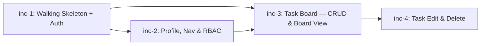

# Increment Delivery Plan — TaskBoard

> **Generated from:** prd.md, frd-auth.md, frd-profile.md, frd-rbac.md, frd-task-management.md, frd-task-board.md, screen-map.md, flow-walkthrough.md

---

## Dependency Diagram



**Critical path:** inc-1 → inc-2 → inc-3 → inc-4

---

## Increment 1: Walking Skeleton + Auth Foundation

| Field | Detail |
|-------|--------|
| **ID** | `inc-1` |
| **Title** | Walking Skeleton + Auth Foundation |
| **User Stories** | US-1 (Register), US-2 (Login), US-5 (Logout) |
| **FRDs** | frd-auth |
| **Screens** | Landing Page (`/`), Register Page (`/register`), Login Page (`/login`), NavBar (unauthenticated state only) |
| **Dependencies** | None — this is the first increment |
| **Complexity** | Medium |

### API Endpoints

| Method | Route | Description |
|--------|-------|-------------|
| POST | `/api/auth/register` | Register a new user (username + password). Returns 201, 409, or 400. |
| POST | `/api/auth/login` | Authenticate a user, issue JWT in HTTP-only cookie. Returns 200 or 401. |
| POST | `/api/auth/logout` | Clear session cookie. Returns 200. |
| GET | `/api/auth/me` | Return current user profile (used by auth guard). Returns 200 or 401. |

### Flows Covered

| Flow | Steps |
|------|-------|
| Flow 1: Registration & First Login | Steps 1–9 (full flow) |
| Flow 7: Navigation Awareness | Step 1 (unauthenticated NavBar state) |

### Acceptance Criteria Summary

- A new user can register with username/password; validation errors display for invalid input; duplicate usernames return 409.
- A registered user can log in; JWT is set as HTTP-only cookie; invalid credentials show an error.
- An authenticated user can log out; cookie is cleared; protected routes redirect to `/login`.
- Landing page shows Login/Register CTAs when unauthenticated.
- NavBar renders in unauthenticated state (Login + Register links).
- The full Express API ↔ Next.js ↔ Azure Container Apps deployment pipeline works end-to-end.
- Passwords are hashed with bcrypt before storage.

### Why First

Everything depends on authentication. This increment proves the walking skeleton — Express API serving JWT auth, Next.js consuming it, and the whole thing deployed to Azure Container Apps. No feature can work without auth.

---

## Increment 2: Profile, Navigation & RBAC

| Field | Detail |
|-------|--------|
| **ID** | `inc-2` |
| **Title** | Profile, Navigation & RBAC |
| **User Stories** | US-3 (View Profile), US-6 (Navigation Awareness), US-4 (Role-Based Access) |
| **FRDs** | frd-profile, frd-rbac |
| **Screens** | Profile Page (`/profile`), Admin Page (`/admin`), NavBar (all 3 authenticated states), Landing Page (auth-aware CTAs) |
| **Dependencies** | `inc-1` (requires auth — JWT, `/api/auth/me`, cookie handling) |
| **Complexity** | Medium |

### API Endpoints

| Method | Route | Description |
|--------|-------|-------------|
| GET | `/api/auth/me` | Already implemented in inc-1; consumed by Profile page and NavBar. |
| GET | `/api/admin/users` | Return list of all users (admin only). Returns 200, 401, or 403. |

### Flows Covered

| Flow | Steps |
|------|-------|
| Flow 5: View Profile | Steps 1–4 (full flow including logout from profile) |
| Flow 6: Admin Dashboard | Steps 1–3 (admin view + non-admin 403 denial) |
| Flow 7: Navigation Awareness | Steps 1–5 (all NavBar states: unauth, user, admin, loading, logout) |

### Acceptance Criteria Summary

- Profile page displays username, role badge, and "Member since" date.
- Profile page has a working Logout button.
- First registered user is automatically assigned the `admin` role; subsequent users get `user` role.
- Admin users can access `/admin` and see a table of all registered users (username, role, member since).
- Non-admin users visiting `/admin` see a "403 Forbidden" message (no redirect — stays on page).
- Unauthenticated users visiting `/admin` or `/profile` are redirected to `/login`.
- NavBar renders correctly for all states: loading, unauthenticated, authenticated (user), authenticated (admin).
- Admin NavBar includes an "Admin" link; regular user NavBar does not.
- Landing page shows "Go to Board" CTA when authenticated (instead of Login/Register).

### Why Second

Depends on auth from inc-1. Completes the entire user management layer (profile, roles, admin) before task features begin. This ensures the role model and navigation framework are solid before the board is built on top of them.

---

## Increment 3: Task Board — CRUD & Board View

| Field | Detail |
|-------|--------|
| **ID** | `inc-3` |
| **Title** | Task Board — Create, View & Move |
| **User Stories** | US-7 (Create a Task), US-8 (View the Board), US-9 (Move a Task) |
| **FRDs** | frd-task-management (create only), frd-task-board |
| **Screens** | Board Page (`/board`) — create form, three columns, task cards, move controls |
| **Dependencies** | `inc-1` (auth for scoping tasks to users), `inc-2` (NavBar in authenticated state for board page) |
| **Complexity** | High |

### API Endpoints

| Method | Route | Description |
|--------|-------|-------------|
| GET | `/api/tasks` | List all tasks for the authenticated user. Returns 200 or 401. |
| POST | `/api/tasks` | Create a task (title required, description optional). Returns 201, 400, or 401. |
| PATCH | `/api/tasks/:id` | Update task status (move between columns). Returns 200, 400, 401, or 404. |

### Flows Covered

| Flow | Steps |
|------|-------|
| Flow 2: Task Lifecycle | Steps 1–7 (create tasks, move forward, move backward) |

### Acceptance Criteria Summary

- Board page at `/board` shows three columns: To Do, In Progress, Done — always visible even when empty.
- Each column header shows a task count (e.g., "To Do (3)").
- Empty board shows message: "No tasks yet. Create your first task above!"
- Create task form with required title (max 120 chars) and optional description; validation errors on empty/whitespace title.
- Created tasks appear immediately in "To Do" without page reload.
- Task cards display title and truncated description.
- Move controls: [→] in To Do, [←][→] in In Progress, [←] in Done.
- Status transitions follow To Do ↔ In Progress ↔ Done (no skipping).
- Moves update immediately without page reload; buttons disable during PATCH.
- Only the authenticated user's tasks are visible.
- Tasks within each column are ordered by creation date (oldest first).
- Unauthenticated users are redirected to `/login`.

### Why Third

This is the core product feature — the Kanban board. It depends on auth (inc-1) for user-scoped tasks and the authenticated NavBar (inc-2) for navigation. Create + view + move delivers the primary product value: users can manage their work across columns.

---

## Increment 4: Task Edit & Delete

| Field | Detail |
|-------|--------|
| **ID** | `inc-4` |
| **Title** | Task Edit & Delete |
| **User Stories** | US-10 (Edit a Task), US-11 (Delete a Task) |
| **FRDs** | frd-task-management (edit + delete) |
| **Screens** | Board Page (`/board`) — inline edit form, delete confirmation dialog |
| **Dependencies** | `inc-3` (requires board with task cards to edit/delete) |
| **Complexity** | Medium |

### API Endpoints

| Method | Route | Description |
|--------|-------|-------------|
| PATCH | `/api/tasks/:id` | Update task title and/or description. Returns 200, 400, 401, or 404. |
| DELETE | `/api/tasks/:id` | Delete a task. Returns 204, 401, or 404. |

### Flows Covered

| Flow | Steps |
|------|-------|
| Flow 3: Edit a Task | Steps 1–4 (enter edit mode, save, clear description, cancel) |
| Flow 4: Delete a Task | Steps 1–3 (delete button, confirm, cancel) |

### Acceptance Criteria Summary

- Clicking a task title (or edit icon) opens inline edit mode with pre-populated title and description fields.
- Save commits changes via PATCH; card updates immediately without reload.
- Cancel discards changes and returns to normal card view.
- Empty title is rejected with a validation error; title max 120 chars.
- Description can be cleared (saved as empty string).
- Each task card has a delete button that triggers a confirmation dialog.
- Confirming deletion removes the task immediately; column count updates.
- Cancelling the dialog leaves the task unchanged.
- Deleting the last task in all columns shows the empty board message.
- Full CRUD is complete after this increment.

### Why Fourth

Edit and delete build on the existing board (inc-3). The board is fully usable with create/view/move alone — edit and delete are lower priority enhancements that complete the CRUD story.

---

## Increment Summary

| ID | Title | User Stories | FRDs | Complexity | Dependencies |
|----|-------|-------------|------|------------|--------------|
| `inc-1` | Walking Skeleton + Auth Foundation | US-1, US-2, US-5 | frd-auth | Medium | — |
| `inc-2` | Profile, Navigation & RBAC | US-3, US-4, US-6 | frd-profile, frd-rbac | Medium | inc-1 |
| `inc-3` | Task Board — Create, View & Move | US-7, US-8, US-9 | frd-task-management, frd-task-board | High | inc-1, inc-2 |
| `inc-4` | Task Edit & Delete | US-10, US-11 | frd-task-management | Medium | inc-3 |

### User Story Coverage

| User Story | Increment | Status |
|-----------|-----------|--------|
| US-1: User Registration | inc-1 | ✅ |
| US-2: User Login | inc-1 | ✅ |
| US-3: View Profile | inc-2 | ✅ |
| US-4: Role-Based Access | inc-2 | ✅ |
| US-5: User Logout | inc-1 | ✅ |
| US-6: Navigation Awareness | inc-2 | ✅ |
| US-7: Create a Task | inc-3 | ✅ |
| US-8: View the Board | inc-3 | ✅ |
| US-9: Move a Task | inc-3 | ✅ |
| US-10: Edit a Task | inc-4 | ✅ |
| US-11: Delete a Task | inc-4 | ✅ |

All 11 user stories are covered across 4 increments.

### Flow Coverage

| Flow | Increment |
|------|-----------|
| Flow 1: Registration & First Login | inc-1 |
| Flow 2: Task Lifecycle (Create, View, Move) | inc-3 |
| Flow 3: Edit a Task | inc-4 |
| Flow 4: Delete a Task | inc-4 |
| Flow 5: View Profile | inc-2 |
| Flow 6: Admin Dashboard | inc-2 |
| Flow 7: Navigation Awareness | inc-1 (partial), inc-2 (complete) |

All 7 flows are covered.

---

## Pipeline Per Increment

Each increment goes through the full delivery pipeline:

```
Step 1: Tests          → e2e specs (Playwright), Gherkin scenarios, Cucumber steps, Vitest units
Step 2: Contracts      → OpenAPI specs, shared TypeScript types, infra requirements
Step 3: Implementation → API slice + Web slice (parallel) → Integration slice
Step 4: Verify & Ship  → Full regression → azd provision → azd deploy → smoke tests
```

After each increment completes Step 4, `main` is green and deployed to Azure.
