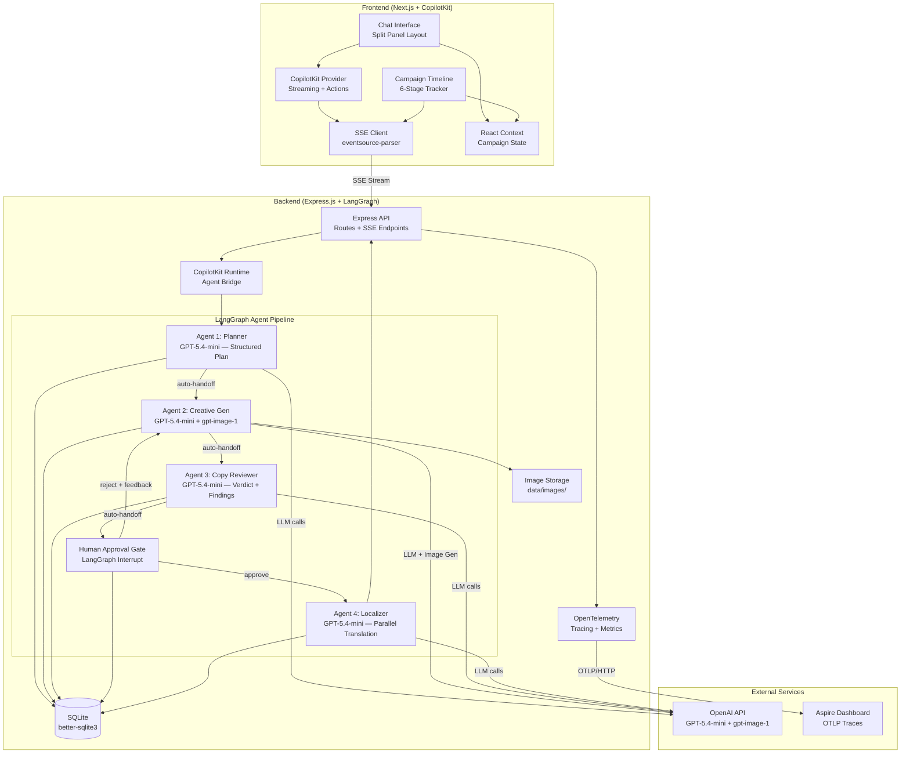

# Tech Stack: AI Marketing Campaign Assistant

## Overview

Single-user demo application showcasing multi-agent AI orchestration with human-in-the-loop approval. Four LangGraph agents (Planner, Creative Generator, Copy Reviewer, Localizer) run on an Express.js backend, streamed to a Next.js + CopilotKit frontend via SSE. SQLite provides lightweight persistence, OpenTelemetry provides distributed tracing, and the whole stack deploys to Azure Container Apps via Aspire + azd.

---

## Stack Decisions

### 1. AI Agent Orchestration — LangGraph.js

- **Choice**: LangGraph.js
- **Package(s)**: `@langchain/langgraph@^1.2.6`, `@langchain/core@^1.1.36`
- **Why**: Per AGENTS.md, LangGraph.js is the mandated framework for backend agent orchestration. It provides stateful graph-based workflows with nodes (tools, LLM calls, logic), edges (conditional routing, cycles), checkpointing for persistence, and first-class human-in-the-loop interrupt/resume — all required by the 4-agent pipeline with rejection loops (FRD-human-approval).
- **Env vars**: None (orchestration framework, no API keys)
- **Used by**: All agent FRDs (campaign-planning, creative-generation, copy-review, localization), human-approval (checkpoint interrupt/resume), data-persistence (LangGraph checkpointing)
- **Install target**: `src/api`

### 2. LLM Provider — OpenAI GPT-5.4-mini

- **Choice**: OpenAI GPT-5.4-mini via LangChain integration
- **Package(s)**: `@langchain/openai@^1.3.1`
- **Why**: GPT-5.4-mini is the latest cost-effective model in the GPT-5.4 family (400K context window, 128K output tokens). It provides fast, high-quality structured text generation for campaign plans, copy review reports, and translations — ideal for a demo app that doesn't need flagship-tier reasoning. LangChain's OpenAI integration provides structured output binding, streaming, and retry logic that map directly to FRD requirements.
- **Model ID**: `gpt-5.4-mini`
- **Env vars**: `OPENAI_API_KEY` — OpenAI API key for all LLM calls
- **Used by**: frd-campaign-planning (plan generation), frd-copy-review (brand/legal/tone checks), frd-localization (parallel translation), frd-creative-generation (caption/hashtag generation)
- **Install target**: `src/api`

### 3. Image Generation — OpenAI GPT Image 1

- **Choice**: OpenAI gpt-image-1 via direct OpenAI SDK
- **Package(s)**: `openai@^6.33.0`
- **Why**: gpt-image-1 is OpenAI's flagship image generation model, replacing the DALL-E series. It uses an autoregressive architecture for better instruction following, text rendering, and style control. The direct OpenAI SDK provides full control over parameters (size, quality, output_format) and returns base64 or URLs directly. Required by frd-creative-generation for "real AI-generated image (not placeholder)".
- **Model ID**: `gpt-image-1`
- **API**: `openai.images.generate({ model: "gpt-image-1", prompt, size, quality, response_format })`
- **Params**: size (`1024x1024`, `1536x1024`, `1024x1536`), quality (`low`, `medium`, `high`), response_format (`b64_json`, `url`)
- **Env vars**: `OPENAI_API_KEY` (shared with LLM provider)
- **Used by**: frd-creative-generation (image generation, regeneration on rejection)
- **Install target**: `src/api`

### 4. Frontend AI Integration — CopilotKit

- **Choice**: CopilotKit
- **Package(s)**: `@copilotkit/react-core@^1.54.1`, `@copilotkit/react-ui@^1.54.1`
- **Why**: Per AGENTS.md, CopilotKit is the mandated framework for frontend AI copilot UX. It provides the `<CopilotKit>` provider, streaming chat integration, and action hooks that map to the chat interface requirements. CoAgents integration connects the frontend to LangGraph backend agents.
- **Env vars**: None (frontend package, configured at runtime)
- **Used by**: frd-chat-interface (chat UI, streaming display), frd-human-approval (inline approval UX), frd-localization (market selection UX)
- **Install target**: `src/web`

- **Runtime package**: `@copilotkit/runtime@^1.54.1`
- **Why**: Server-side CopilotKit runtime for bridging frontend requests to LangGraph agents. Handles streaming, action dispatch, and agent coordination.
- **Install target**: `src/api`

### 5. Database / Persistence — SQLite

- **Choice**: SQLite via better-sqlite3
- **Package(s)**: `better-sqlite3@^12.8.0`, `@types/better-sqlite3@^7.6.13` (dev)
- **Why**: Single-user demo with no concurrent access requirements. SQLite provides zero-config, file-based persistence that simplifies local development and containerized deployment. Supports all persistence requirements in frd-data-persistence (campaign state, chat history, iteration history) without needing a managed database service.
- **Env vars**: `DATABASE_PATH` — path to SQLite database file (default: `data/campaign.db`)
- **Used by**: frd-data-persistence (all stage persistence, chat history, campaign archival), frd-human-approval (iteration history), frd-creative-generation (image metadata)
- **Install target**: `src/api`
- **Note**: Database file stored in `data/` directory. For Azure deployment, uses ephemeral storage (acceptable for demo — data resets on container restart). Production would use Azure Database for PostgreSQL.

### 6. Image Storage — Local Filesystem

- **Choice**: Express static file serving from local filesystem
- **Package(s)**: None (built into Express)
- **Why**: Single-user demo with no CDN or blob storage requirements. Images saved as files in `data/images/` and served via Express static middleware at `/api/campaigns/{id}/images/{version}`. Simplest approach that satisfies frd-data-persistence image URL requirements.
- **Env vars**: `IMAGE_STORAGE_PATH` — directory for image files (default: `data/images`)
- **Used by**: frd-creative-generation (image storage), frd-data-persistence (image URL generation, image serving)
- **Install target**: `src/api`

### 7. Schema Validation — Zod

- **Choice**: Zod v3 (stable)
- **Package(s)**: `zod@^3.24.2`
- **Why**: Runtime validation of LLM outputs is critical — agents produce structured JSON (campaign plans, review reports, translations) that must conform to TypeScript interfaces. Zod provides TypeScript-first schema validation with `.parse()` that throws on invalid data, plus `.safeParse()` for graceful handling. Used with LangChain's structured output binding (`withStructuredOutput`).
- **Env vars**: None
- **Used by**: frd-campaign-planning (plan schema validation), frd-copy-review (review report validation), frd-localization (translation result validation), frd-creative-generation (caption/hashtag validation)
- **Install target**: `src/api`
- **Note**: Using Zod v3 (not v4) for maximum compatibility with `@langchain/core` which depends on Zod v3 for structured output schemas.

### 8. SSE Streaming — Native Node.js

- **Choice**: Native SSE via Express response streams (backend), EventSource API + `eventsource-parser` (frontend)
- **Package(s)**: `eventsource-parser@^3.0.6` (frontend only, for robust SSE parsing)
- **Why**: SSE is the simplest unidirectional streaming protocol. No WebSocket complexity needed — agents stream tokens to client, client never streams back. Express natively supports `text/event-stream` responses. The `eventsource-parser` package handles edge cases in SSE parsing (partial chunks, reconnection).
- **Env vars**: None
- **Used by**: frd-chat-interface (token-by-token streaming), frd-campaign-timeline (real-time stage updates), frd-creative-generation (status messages during image gen)
- **Install target**: `src/web` (eventsource-parser)

### 9. Markdown Rendering — react-markdown + remark-gfm

- **Choice**: react-markdown (already installed) + remark-gfm plugin
- **Package(s)**: `react-markdown@^10.1.0` (existing), `remark-gfm@^4.0.1` (new)
- **Why**: Agent responses contain markdown (campaign plans, review reports). react-markdown renders safely (no dangerouslySetInnerHTML). remark-gfm adds GitHub Flavored Markdown support (tables for review reports, strikethrough, task lists).
- **Env vars**: None
- **Used by**: frd-chat-interface (chat message rendering), frd-human-approval (review report display), frd-localization (translation display)
- **Install target**: `src/web`

### 10. State Management (Frontend) — React Context + useReducer

- **Choice**: React Context API with useReducer
- **Package(s)**: None (built into React 19)
- **Why**: Single-user demo with straightforward state shape (current campaign, chat messages, timeline stage). No need for Redux/Zustand complexity. useReducer provides predictable state transitions for campaign lifecycle (planning → generating → reviewing → approval → localizing → complete). CopilotKit manages its own chat state internally.
- **Env vars**: None
- **Used by**: frd-chat-interface (chat state), frd-campaign-timeline (stage tracking), frd-data-persistence (campaign restoration on refresh)
- **Install target**: `src/web`

### 11. Observability — OpenTelemetry + Prometheus

- **Choice**: OpenTelemetry SDK for distributed tracing, prom-client for Prometheus metrics
- **Package(s)**:
  - `@opentelemetry/sdk-node@^0.214.0` — Node.js SDK (auto-instrumentation)
  - `@opentelemetry/api@^1.9.1` — Trace/span API for manual instrumentation
  - `@opentelemetry/sdk-trace-node@^2.6.1` — Trace SDK for Node.js
  - `@opentelemetry/exporter-trace-otlp-http@^0.214.0` — OTLP exporter (Aspire dashboard)
  - `@opentelemetry/resources@^2.6.1` — Resource attributes (service name, version)
  - `@opentelemetry/semantic-conventions@^1.40.0` — Standard attribute names
  - `@opentelemetry/instrumentation-http@^0.214.0` — Auto-instrument HTTP calls
  - `@opentelemetry/instrumentation-express@^0.62.0` — Auto-instrument Express routes
  - `prom-client@^15.1.3` — Prometheus metrics (agent.duration_ms, campaign.rejection_count, campaign.market_count)
- **Why**: frd-observability requires distributed tracing (root span per campaign, child spans per agent/AI call), structured logging correlation (traceId/spanId in pino logs), and Prometheus `/metrics` endpoint. OTel is the standard, Aspire dashboard natively consumes OTLP traces. prom-client is the de facto Prometheus client for Node.js.
- **Env vars**:
  - `OTEL_EXPORTER_OTLP_ENDPOINT` — OTLP collector endpoint (default: Aspire dashboard)
  - `OTEL_SERVICE_NAME` — Service name for traces (default: `campaign-api`)
  - `METRICS_ENABLED` — Enable `/metrics` endpoint (default: `true`)
- **Used by**: frd-observability (all tracing, logging, metrics requirements)
- **Install target**: `src/api`

### 12. Unique ID Generation — uuid

- **Choice**: uuid v7 (time-ordered)
- **Package(s)**: `uuid@^13.0.0`, `@types/uuid@^11.0.0` (dev)
- **Why**: Campaign IDs, image filenames, and trace correlation IDs need unique, time-sortable identifiers. UUIDv7 provides time-ordering for database queries while maintaining uniqueness. Required by frd-data-persistence for campaign IDs and frd-creative-generation for image filenames.
- **Env vars**: None
- **Used by**: frd-data-persistence (campaign IDs), frd-creative-generation (image filenames), frd-observability (correlation IDs)
- **Install target**: `src/api`

### 13. Logging — pino (existing)

- **Choice**: pino + pino-http (already installed)
- **Package(s)**: `pino@^9.7.0` (existing), `pino-http@^10.4.0` (existing)
- **Why**: Already installed and configured. Produces structured NDJSON logs to stdout as required by frd-observability. pino-http automatically logs HTTP requests. OTel trace context (traceId, spanId) will be injected into pino log records via a custom serializer.
- **Env vars**: `LOG_LEVEL` — logging level (default: `info`, development: `debug`)
- **Used by**: frd-observability (all structured logging)
- **Install target**: `src/api` (already installed)

---

## Existing Dependencies (No Changes Needed)

These packages are already installed and satisfy their respective requirements:

| Package | Version | Location | Used by |
|---------|---------|----------|---------|
| `express` | ^5.1.0 | src/api | All API routes, SSE streaming, static file serving |
| `cors` | ^2.8.5 | src/api | Cross-origin requests from Next.js frontend |
| `helmet` | ^8.1.0 | src/api | Security headers |
| `cookie-parser` | ^1.4.7 | src/api | Cookie handling |
| `pino` | ^9.7.0 | src/api | Structured logging (frd-observability) |
| `pino-http` | ^10.4.0 | src/api | HTTP request logging (frd-observability) |
| `next` | 16.1.6 | src/web | Frontend framework |
| `react` | 19.2.3 | src/web | UI library |
| `react-dom` | 19.2.3 | src/web | DOM rendering |
| `react-markdown` | ^10.1.0 | src/web | Markdown rendering in chat (frd-chat-interface) |
| `tailwindcss` | ^4 | src/web | Styling (frd-chat-interface, frd-campaign-timeline) |
| `vitest` | ^3.1.0 | src/api | Unit testing |
| `supertest` | ^7.1.0 | src/api | HTTP testing |
| `@playwright/test` | ^1.58.2 | root | E2E testing |
| `@cucumber/cucumber` | ^12.6.0 | root | BDD testing |

---

## Environment Variables

| Variable | Required | Default | Description |
|----------|----------|---------|-------------|
| `OPENAI_API_KEY` | **Yes** | — | OpenAI API key for GPT-5.4-mini and gpt-image-1 |
| `DATABASE_PATH` | No | `data/campaign.db` | Path to SQLite database file |
| `IMAGE_STORAGE_PATH` | No | `data/images` | Directory for generated images |
| `OTEL_EXPORTER_OTLP_ENDPOINT` | No | `http://localhost:4318` | OTLP collector endpoint |
| `OTEL_SERVICE_NAME` | No | `campaign-api` | Service name in traces |
| `METRICS_ENABLED` | No | `true` | Enable Prometheus `/metrics` endpoint |
| `LOG_LEVEL` | No | `info` | Logging level (`debug`, `info`, `warn`, `error`) |
| `PORT` | No | `8080` | API server port |
| `WEB_URL` | No | `http://localhost:3000` | Frontend URL (for CORS) |
| `API_URL` | No | `http://localhost:5001` | API URL (for frontend config) |

---

## Package Installation Commands

### Backend (src/api)

```bash
cd src/api

# AI Agent Orchestration
npm install @langchain/langgraph@^1.2.6 @langchain/core@^1.1.36 @langchain/openai@^1.3.1

# Image Generation (direct OpenAI SDK)
npm install openai@^6.33.0

# CopilotKit Runtime (server-side)
npm install @copilotkit/runtime@^1.54.1

# Database
npm install better-sqlite3@^12.8.0

# Schema Validation
npm install zod@^3.24.2

# Observability
npm install @opentelemetry/sdk-node@^0.214.0 @opentelemetry/api@^1.9.1 @opentelemetry/sdk-trace-node@^2.6.1 @opentelemetry/exporter-trace-otlp-http@^0.214.0 @opentelemetry/resources@^2.6.1 @opentelemetry/semantic-conventions@^1.40.0 @opentelemetry/instrumentation-http@^0.214.0 @opentelemetry/instrumentation-express@^0.62.0 prom-client@^15.1.3

# Unique IDs
npm install uuid@^13.0.0

# Dev dependencies
npm install --save-dev @types/better-sqlite3@^7.6.13 @types/uuid@^11.0.0
```

### Frontend (src/web)

```bash
cd src/web

# CopilotKit (frontend)
npm install @copilotkit/react-core@^1.54.1 @copilotkit/react-ui@^1.54.1

# SSE Parsing
npm install eventsource-parser@^3.0.6

# Markdown enhancement
npm install remark-gfm@^4.0.1
```

---

## Architecture Diagram



---

## Decision Traceability Matrix

| Technology | FRD(s) | Increment(s) |
|------------|--------|--------------|
| LangGraph.js | campaign-planning, creative-generation, copy-review, human-approval, localization | inc-01 through inc-05 |
| OpenAI GPT-5.4-mini | campaign-planning, copy-review, localization, creative-generation | inc-01 through inc-05 |
| OpenAI gpt-image-1 | creative-generation | inc-02 |
| CopilotKit | chat-interface, human-approval, localization | inc-01, inc-04, inc-05 |
| SQLite | data-persistence, human-approval | inc-01 (basic), inc-06 (full) |
| Zod | campaign-planning, creative-generation, copy-review, localization | inc-01 through inc-05 |
| SSE (native) | chat-interface, campaign-timeline | inc-01, inc-02, inc-04 |
| react-markdown + remark-gfm | chat-interface | inc-01 |
| React Context | chat-interface, campaign-timeline, data-persistence | inc-01, inc-06 |
| OpenTelemetry | observability | inc-01 (basic), inc-07 (full) |
| prom-client | observability | inc-07 |
| pino (existing) | observability | inc-01 (existing), inc-07 (enhanced) |
| uuid | data-persistence, creative-generation | inc-01, inc-02 |
| Express static | creative-generation, data-persistence | inc-02 |

---

## Technology Constraints & Notes

1. **Zod v3 vs v4**: Use Zod v3 (`^3.24.2`) — `@langchain/core` depends on Zod v3 for `withStructuredOutput()` schema binding. Zod v4 has breaking API changes that are not yet supported by LangChain.

2. **SQLite in containers**: SQLite data does not persist across Azure Container Apps restarts. This is acceptable for a single-user demo. Production path: migrate to Azure Database for PostgreSQL Flexible Server with the same schema.

3. **Image storage in containers**: Generated images stored on local filesystem are ephemeral in containers. Acceptable for demo. Production path: Azure Blob Storage with SAS token URLs.

4. **OpenAI API key**: Single key used for both GPT-5.4-mini and gpt-image-1. Must be configured as an Azure Container Apps secret for deployment.

5. **CopilotKit + LangGraph wiring**: CopilotKit's `@copilotkit/runtime` on the backend bridges HTTP/SSE requests to LangGraph agent graphs. The frontend `<CopilotKit>` provider connects to this runtime endpoint.

6. **OTel SDK initialization**: The `@opentelemetry/sdk-node` must be initialized before any other imports (top of `src/api/src/index.ts` or in a separate `tracing.ts` loaded via `--require`). This ensures all HTTP/Express instrumentation is captured.

7. **Express 5**: The project uses Express 5 (`^5.1.0`), which has native async error handling. No need for `express-async-errors` wrapper.

8. **Next.js 16 + React 19**: Using the latest Next.js with App Router and React 19 Server Components. CopilotKit components require `'use client'` directive.
