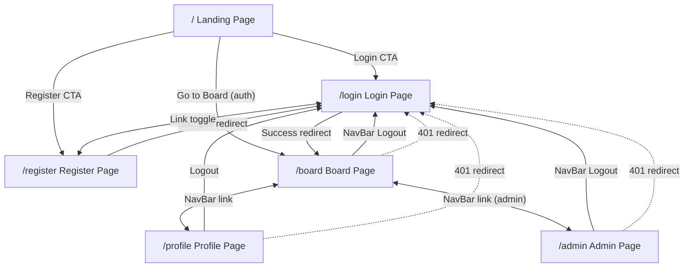

# Screen Map — TaskBoard

> **Generated from:** prd.md, frd-auth.md, frd-profile.md, frd-rbac.md, frd-task-management.md, frd-task-board.md

---

## Navigation Flow Diagram

---

## Persistent Component: Navigation Bar

| Attribute | Detail |
|-----------|--------|
| **Component** | NavBar (root layout, every page) |
| **FRD reference** | frd-profile §5 |
| **Purpose** | Provide role-aware navigation across all pages |

### Key Elements

- **App name link** — text "TaskBoard", links to `/`
- **Navigation links** — vary by auth state (see States below)
- **Logout button** — triggers `POST /api/auth/logout`, redirects to `/login`

### States

| State | Visible Elements |
|-------|-----------------|
| **Loading** (auth check in-flight) | App name only — no links, no buttons |
| **Unauthenticated** | App name, Login (`/login`), Register (`/register`) |
| **Authenticated (user role)** | App name, Board (`/board`), Profile (`/profile`), Logout button |
| **Authenticated (admin role)** | App name, Board (`/board`), Profile (`/profile`), Admin (`/admin`), Logout button |
| **Network error** (auth check fails) | Falls back to Unauthenticated state |

---

## Screen 1: Landing Page

| Attribute | Detail |
|-----------|--------|
| **Route** | `/` |
| **Purpose** | Welcome users and direct them to login, register, or the board |
| **FRD reference** | frd-profile §6 |

### Key Elements

- **Heading** — "TaskBoard"
- **Description** — "A personal task management board. Track your work with ease."
- **CTA buttons** — Login (`/login`), Register (`/register`) when unauthenticated; "Go to Board" (`/board`) when authenticated

### States

| State | Behavior |
|-------|----------|
| **Loading** (auth check in-flight) | Heading and description shown; no CTA buttons |
| **Unauthenticated** | Login and Register CTAs visible |
| **Authenticated** | "Go to Board" CTA visible |

### Navigation

| From | To |
|------|----|
| — (entry point) | Landing |
| Landing → Login CTA | `/login` |
| Landing → Register CTA | `/register` |
| Landing → Go to Board | `/board` |

---

## Screen 2: Register Page

| Attribute | Detail |
|-----------|--------|
| **Route** | `/register` |
| **Purpose** | Allow new users to create an account |
| **FRD reference** | frd-auth §6.1, frd-auth §3 (validation rules) |

### Key Elements

- **Username text input** — required
- **Password input** — required, min length enforced
- **"Register" submit button**
- **Inline error message area** — above form, shown on validation/server errors
- **Loading indicator** — "Registering…" text while request in-flight
- **Link** — "Already have an account? Log in" → `/login`

### States

| State | Behavior |
|-------|----------|
| **Default** | Empty form, submit enabled |
| **Submitting** | Submit button disabled, "Registering…" indicator shown |
| **Validation error** | Client-side: empty username, empty password, password too short |
| **Conflict error (409)** | "Username already exists" inline message |
| **Server error (400)** | Inline error message displayed |
| **Success (201)** | Redirect to `/login?registered=true` |

### Navigation

| From | To |
|------|----|
| Landing → Register CTA | `/register` |
| Login → "Register" link | `/register` |
| Register → Success | `/login?registered=true` |
| Register → "Log in" link | `/login` |

---

## Screen 3: Login Page

| Attribute | Detail |
|-----------|--------|
| **Route** | `/login` |
| **Purpose** | Authenticate existing users |
| **FRD reference** | frd-auth §6.2, frd-auth §4 (auth flow) |

### Key Elements

- **Username text input** — required
- **Password input** — required
- **"Log in" submit button**
- **Inline error message area** — above form, shown on 401/400 errors
- **Loading indicator** — "Logging in…" text while request in-flight
- **Success banner** — "Registration successful. Please log in." when `?registered=true`
- **Link** — "Don't have an account? Register" → `/register`

### States

| State | Behavior |
|-------|----------|
| **Default** | Empty form, submit enabled |
| **Post-registration** | Success message shown from `?registered=true` query param |
| **Submitting** | Submit button disabled, "Logging in…" indicator shown |
| **Invalid credentials (401)** | Inline error "Invalid username or password" |
| **Validation error (400)** | Inline error for missing fields |
| **Success (200)** | Redirect to `/board` |

### Navigation

| From | To |
|------|----|
| Landing → Login CTA | `/login` |
| Register → Success redirect | `/login?registered=true` |
| Register → "Log in" link | `/login` |
| Auth guard redirect (any protected page) | `/login` |
| Login → Success | `/board` |
| Login → "Register" link | `/register` |

---

## Screen 4: Board Page

| Attribute | Detail |
|-----------|--------|
| **Route** | `/board` |
| **Purpose** | Display Kanban board for creating, viewing, moving, editing, and deleting tasks |
| **FRD reference** | frd-task-board §3–§9, frd-task-management §6 |

This is the most complex screen in the application.

### Key Elements

#### Create Task Form (above board columns)
- **Title text input** — required, max 120 characters
- **Description textarea** — optional
- **"Add Task" submit button**
- **Inline error message** — shown on empty title or validation failure

#### Board Layout
- **Three columns** — To Do, In Progress, Done
- **Column headers with task counts** — e.g. "To Do (3)", "In Progress (1)", "Done (0)"
- Columns are always visible even when empty

#### Task Card (per task)
- **Title** — displayed prominently
- **Description** — truncated display
- **Move buttons** — directional controls to change status:
  - To Do column: `→` (move to In Progress)
  - In Progress column: `←` (move to To Do), `→` (move to Done)
  - Done column: `←` (move to In Progress)
- **Edit trigger** — clicking task title or edit icon opens edit UI
- **Delete button/icon** — triggers confirmation dialog

#### Edit Task UI (inline or modal)
- **Editable title field**
- **Editable description field**
- **Save button** — commits via `PATCH /api/tasks/:id`
- **Cancel button** — discards changes

#### Delete Confirmation Dialog
- **Text** — "Are you sure you want to delete this task?"
- **Confirm button** — executes `DELETE /api/tasks/:id`
- **Cancel button** — dismisses dialog

### States

| State | Behavior |
|-------|----------|
| **Auth check** | `GET /api/auth/me` on mount |
| **Unauthenticated (401)** | Redirect to `/login` |
| **Bootstrap error** | Auth network failure → "Unable to load the board. Please check your connection and try again." + Retry button |
| **Loading tasks** | "Loading board…" spinner/skeleton after auth succeeds |
| **Board loaded (success)** | Three columns rendered with task cards |
| **Empty board** | All columns visible with `(0)` counts; message "No tasks yet. Create your first task above!" |
| **Partial empty columns** | Individual empty columns show `(0)` — no special message |
| **Task load error** | "Failed to load tasks. Please try again." + Retry button |
| **Move in-flight** | Move buttons disabled during PATCH request |
| **Move error (400)** | Error notification; task stays in current column |
| **Move 404** | Task removed from board (deleted by another context) |
| **Create success** | Task appears immediately in To Do column |
| **Edit success** | Task card updates immediately |
| **Delete success** | Task card removed immediately |
| **Responsive: desktop** | Columns side-by-side |
| **Responsive: mobile** | Columns stacked vertically with scroll |
| **Large dataset (100+ tasks)** | Column scrollable, no pagination |

### Navigation

| From | To |
|------|----|
| Login → Success | `/board` |
| Landing → Go to Board | `/board` |
| NavBar → Board link | `/board` |
| Board → 401 on any API call | `/login` |
| Board → NavBar links | `/profile`, `/admin` (admin only) |

---

## Screen 5: Profile Page

| Attribute | Detail |
|-----------|--------|
| **Route** | `/profile` |
| **Purpose** | Display the authenticated user's account information and provide logout |
| **FRD reference** | frd-profile §3, frd-auth §6.3 |

### Key Elements

- **Centered profile card** containing:
  - **Username** — displayed as text
  - **Role badge** — styled badge showing "user" or "admin"
  - **Member since** — human-readable formatted date (from `createdAt`)
- **Logout button** — below the profile card, labeled "Logout"
- **Loading spinner** — "Loading profile…"
- **Error message** — "Failed to load profile. Please try again."
- **Retry button** — re-runs `GET /api/auth/me`

### States

| State | Behavior |
|-------|----------|
| **Loading** | Spinner + "Loading profile…" |
| **Success** | Profile card rendered with username, role badge, member since, logout button |
| **Error** | "Failed to load profile. Please try again." + Retry button |
| **401 Unauthorized** | Redirect to `/login` |

### Navigation

| From | To |
|------|----|
| NavBar → Profile link | `/profile` |
| Profile → Logout | `POST /api/auth/logout` → `/login` |
| Profile → 401 | `/login` |

---

## Screen 6: Admin Page

| Attribute | Detail |
|-----------|--------|
| **Route** | `/admin` |
| **Purpose** | Display all registered users for admin-role users; deny access to non-admins |
| **FRD reference** | frd-rbac §6, frd-rbac §7 |

### Key Elements

#### Admin Dashboard (admin role)
- **Page title** — h1 "Admin Dashboard"
- **Users table** with columns:
  - Username
  - Role
  - Member Since
- **Loading indicator** — "Loading users…"
- **Error message** — "Failed to load users."

#### Access Denied (non-admin role)
- **Heading** — "403 Forbidden"
- **Message** — "You do not have permission to view this page."

### States

| State | Behavior |
|-------|----------|
| **Auth check** | `GET /api/auth/me` on mount |
| **Unauthenticated (401)** | Redirect to `/login` |
| **Authenticated, non-admin** | "403 Forbidden" + denial message (stays on `/admin`) |
| **Authenticated, admin — loading** | "Loading users…" indicator |
| **Authenticated, admin — success** | Users table rendered |
| **Authenticated, admin — error** | "Failed to load users." message |

### Navigation

| From | To |
|------|----|
| NavBar → Admin link (admin only) | `/admin` |
| Admin → 401 | `/login` |
| Admin → NavBar links | `/board`, `/profile` |

---

## Screen Inventory Summary

| # | Screen | Route | Primary FRD | Complexity |
|---|--------|-------|-------------|------------|
| 1 | Landing Page | `/` | frd-profile §6 | Low |
| 2 | Register Page | `/register` | frd-auth §6.1 | Medium |
| 3 | Login Page | `/login` | frd-auth §6.2 | Medium |
| 4 | Board Page | `/board` | frd-task-board §3, frd-task-management §6 | High |
| 5 | Profile Page | `/profile` | frd-profile §3 | Low |
| 6 | Admin Page | `/admin` | frd-rbac §6 | Medium |
| — | Navigation Bar | (all pages) | frd-profile §5 | Medium |

---

## Auth Guard Summary

All protected pages share the same auth guard pattern:

1. On mount → `GET /api/auth/me`
2. **200** → render page content
3. **401** → redirect to `/login`
4. **Network error** → error state with Retry (or fallback to unauthenticated)

| Route | Auth Required | Role Required | Guard Behavior on Failure |
|-------|--------------|---------------|--------------------------|
| `/` | No | — | Shows unauthenticated CTAs |
| `/login` | No | — | — |
| `/register` | No | — | — |
| `/board` | Yes | any | Redirect to `/login` |
| `/profile` | Yes | any | Redirect to `/login` |
| `/admin` | Yes | admin | non-admin → 403 display; unauth → redirect `/login` |
